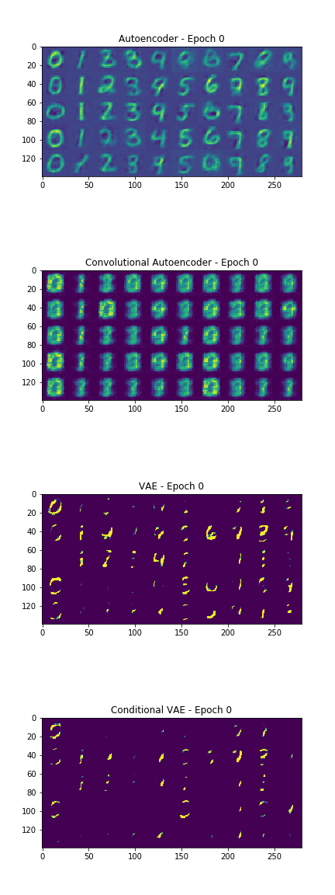

## PyTorch Autoencoders

This repo contains implementations of the following Autoencoders:
- Vanilla Autoencoder
- Convolutional Autoencoder
- Variational Autoencoder (VAE)
- Conditional Variational Autoencoder

Results:

